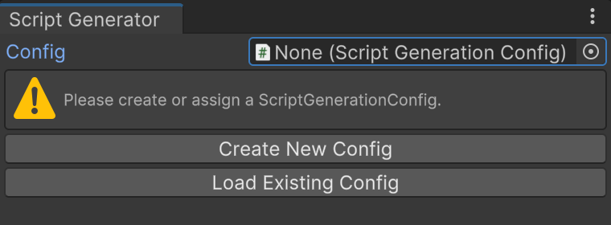
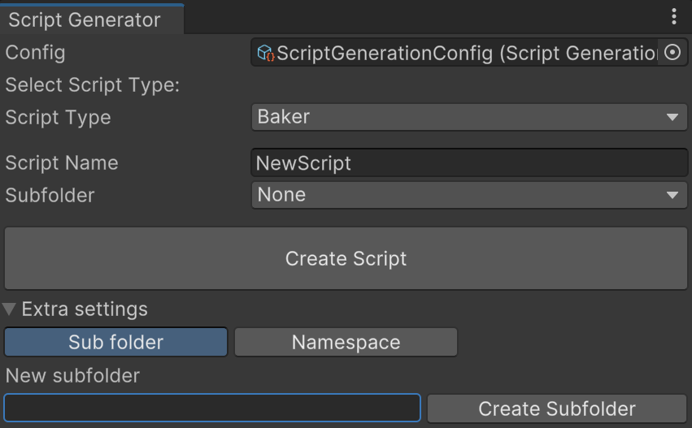

 
# DG Script Generation
The script generator is used to create new script files and place them in predefined folders which you can easily change.

Easy way to make new templates and keep your project organized.

You setup a base folder, defaults to "Assets/Scripts", and for example you want to create a Unity DOTS System, you select that type in the tool, write a script name and click create script.
This will output an empty script in the folder "Assets/Scripts/Systems" by default.

#### Installation
1. Download project and import using <b>unity package manager</b> with import local package option.
   or
2. Copy git URL and install with <b>unity package manager</b> with import with git url option.

#### How to use
1. Install the package
2. Go to <b>DG tools</b> menu and open <b>Script Generator</b>

3. Click "Create New Config" and save it in a folder that you prefer. The path to the file is stored in the project settings and will persist to other project members.

4. Select a <b>Script Type</b> and enter a <b>Script name</b> 
5. (Optional step) Select a subfolder or create a new.
   tip: You can create a sub sub folder by entering "Player/Ability".
6. Click <b>Create script</b> to create the script.
7. A dialog will ask if you want to open the file.

#### Settings
You can edit the settings in the config file you created.

More instructions coming soon.
