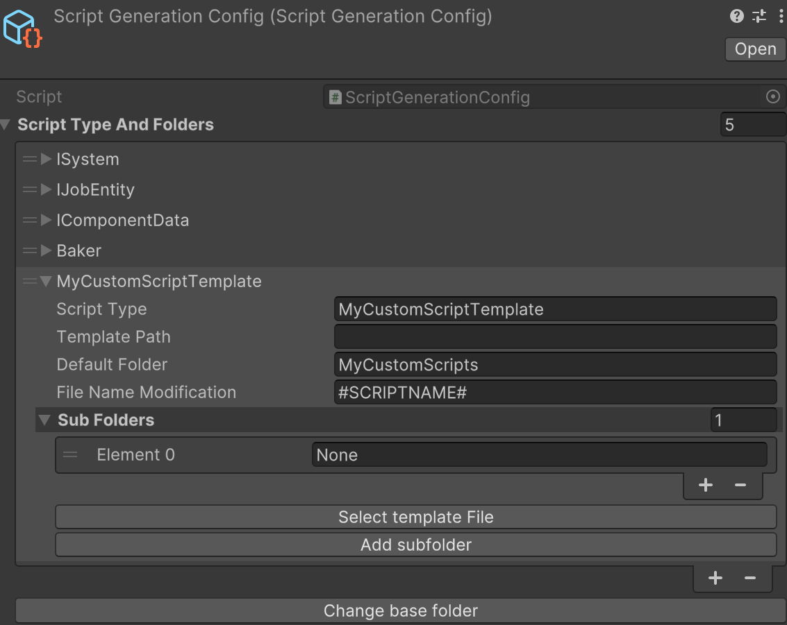

 
# DG Script Generation
The script generator is used to create new script files and place them in predefined folders which you can easily change.

Easy way to make new templates and keep your project organized.

You setup a base folder, defaults to "Assets/Scripts", and for example you want to create a Unity DOTS System, you select that type in the tool, write a script name and click create script.
This will output an empty script in the folder "Assets/Scripts/Systems" by default.

#### Installation
1. Download project and import using <b>unity package manager</b> with import local package option.
   or
2. Copy git URL and install with <b>unity package manager</b> with import with git url option.

#### How to use
1. Install the package
2. Go to <b>DG tools</b> menu and open <b>Script Generator</b>

3. Click "Create New Config" and save it in a folder that you prefer. The path to the file is stored in the project settings and will persist to other project members.

4. Select a <b>Script Type</b> and enter a <b>Script name</b> 
5. (Optional step) Select a subfolder or create a new.
   tip: You can create a sub sub folder by entering "Player/Ability".
6. Click <b>Create script</b> to create the script.
7. A dialog will ask if you want to open the file.

#### Adding your own templates
1. Navigate to and select your ScriptGenerationConfig SO.

3. Click the + button to add a new Script Type
4. <b>Script type</b> is shown in the editor window as a selectable type.
5. <b>TemplatePath</b> is the path to the template, assign by using button below.
6. <b>Default folder</b> is where the scripts will be created.
7. <b>File Name Modification</b> can be used to add prefix or sufix to the files that are created. mostly left as _#SCRIPTNAME#

#### Template File structure
_#SCRIPTNAME# will be replaced by the scriptname you enter when creating a new script.

#### TODO
Add Namespace support
